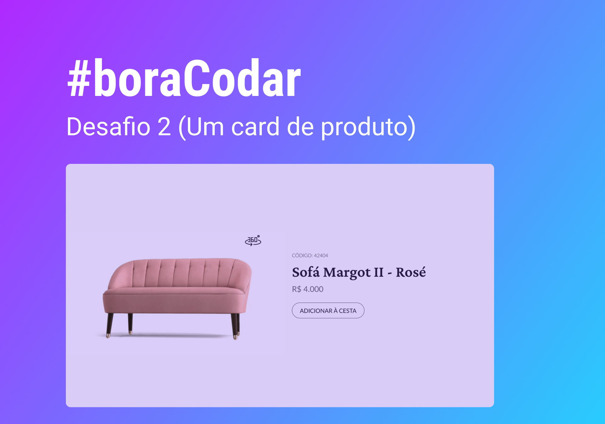

<h1 align="center">#boraCodar - Card de Produto (Desafio 02)</h1>

Programa exclusivo e gratuito, promovido pela Rocketseat para ensino de tecnologias WEB.

  <a href="#-tecnologias">Tecnologias</a>&nbsp;&nbsp;&nbsp;|&nbsp;&nbsp;&nbsp;
  <a href="#-projeto">Projeto</a>&nbsp;&nbsp;&nbsp;|&nbsp;&nbsp;&nbsp;

  

 

## 🚀 Tecnologias

Esse projeto foi desenvolvido com as seguintes tecnologias:

- HTML e CSS
- JavaScript
- Git e Github
- Figma

 

## 💻 Projeto

Seguindo o desafio do #boraCodar, foi desenvolvido um card de projeto com visualização de produto em 3D. O projeto está disponível para visualização no desktop e mobile.

- [Acesse o projeto finalizado aqui](https://vxnicios.github.io/boracodar-cardproduto/)
- [Acesso o projeto no Figma aqui](https://www.figma.com/community/file/1195050984449538256)
